# System Flow Diagrams

## Overview

This document contains comprehensive flow diagrams showing how the licensing verification platform works from credential creation to verification. The diagrams illustrate the complete user journey and system interactions.

## 1. Credential Creation Flow

### **Licensing Board Creates Credential**

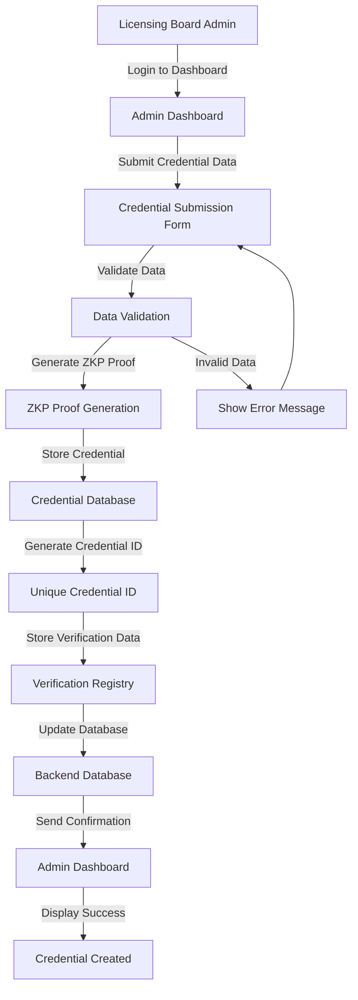

### **Detailed Steps**

1. **Admin Login**: Licensing board admin logs into the web dashboard
2. **Credential Submission**: Admin fills out credential form with:
   - Holder name and personal information
   - License number
   - Exam ID and achievement level
   - Issue and expiry dates
3. **Data Validation**: System validates all required fields
4. **ZKP Generation**: System generates zero-knowledge proof for privacy
5. **Credential Storage**: Credential data is stored in secure database
6. **ID Generation**: Unique credential ID is generated (e.g., MED-2024-001234)
7. **Verification Registry**: Credential is added to verification registry
8. **Database Update**: Backend database is updated with credential info
9. **Confirmation**: Admin receives confirmation of successful creation

## 2. Credential Verification Flow

### **Employer Verifies Credential**

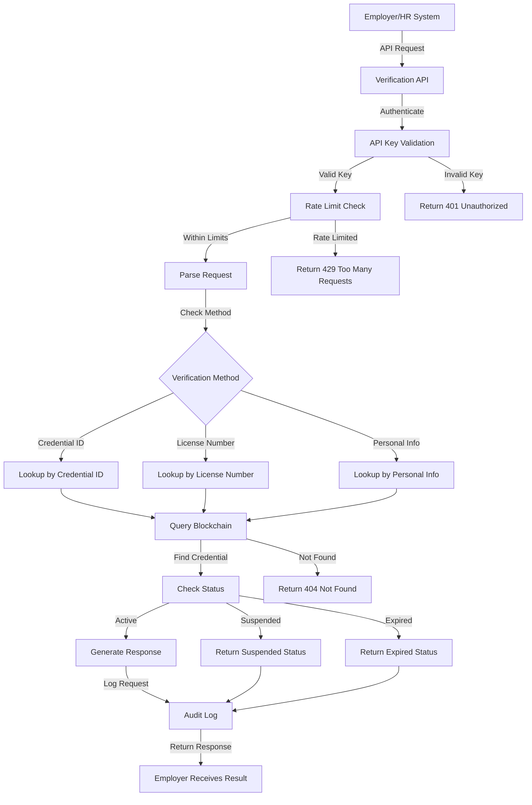

### **Verification Methods**

#### **Method 1: Credential ID Verification**

```typescript
POST /api/v1/verify/credential
{
  "credentialId": "MED-2024-001234",
  "examId": "medical-license-2024"
}
```

#### **Method 2: License Number Verification**

```typescript
POST /api/v1/verify/credential
{
  "licenseNumber": "MD123456",
  "examId": "medical-license-2024"
}
```

#### **Method 3: Personal Information Verification**

```typescript
POST /api/v1/verify/credential
{
  "firstName": "John",
  "lastName": "Smith",
  "dateOfBirth": "1980-05-15",
  "examId": "medical-license-2024"
}
```

## 3. Batch Verification Flow

### **Multiple Credentials Verification**

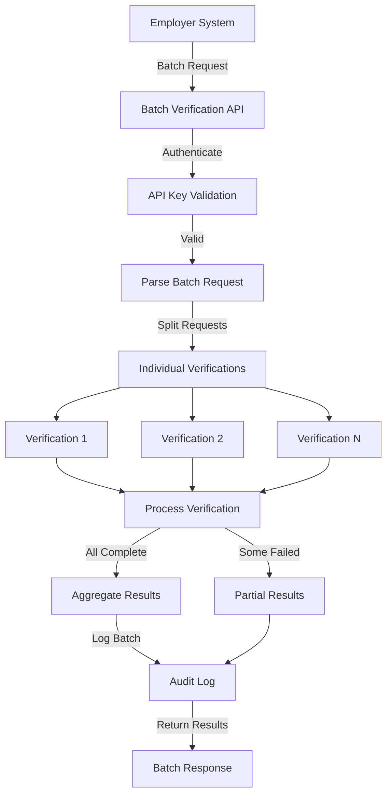

### **Batch Request Example**

```typescript
POST /api/v1/verify/batch
{
  "verifications": [
    {
      "credentialId": "MED-2024-001234",
      "examId": "medical-license-2024"
    },
    {
      "licenseNumber": "MD123456",
      "examId": "medical-license-2024"
    },
    {
      "firstName": "Jane",
      "lastName": "Doe",
      "examId": "medical-license-2024"
    }
  ]
}
```

## 4. Cross-Board Verification Flow

### **Verify Across Multiple Licensing Boards**

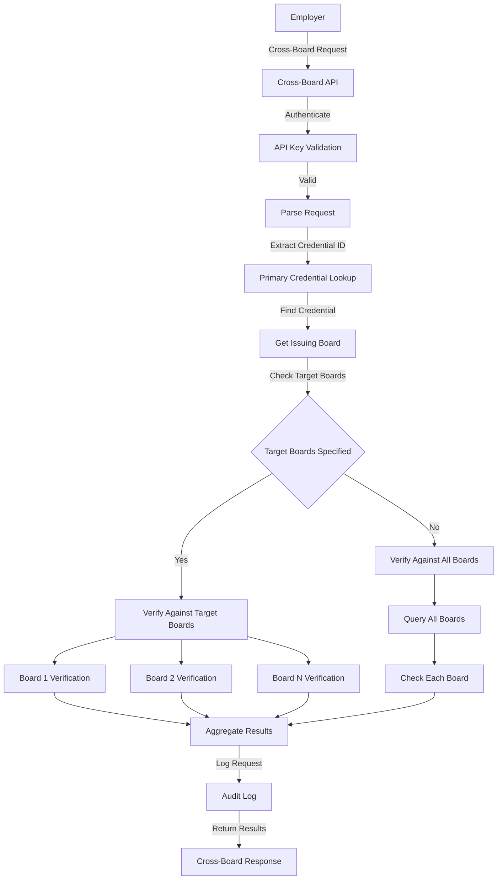

## 5. Document Verification Flow

### **Verify Document Authenticity**

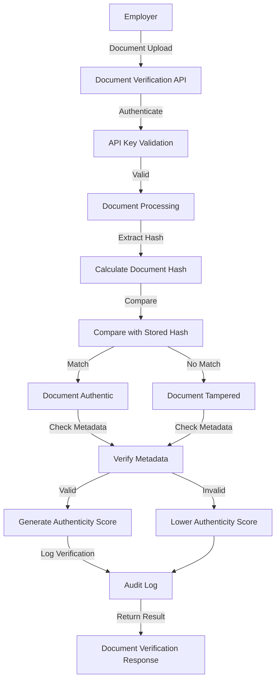

## 6. Real-Time Status Check Flow

### **Check Credential Status**

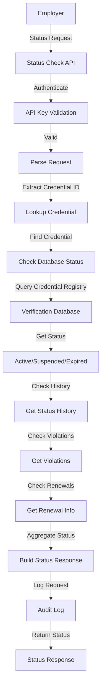

## 7. Admin Dashboard Flow

### **Licensing Board Management**

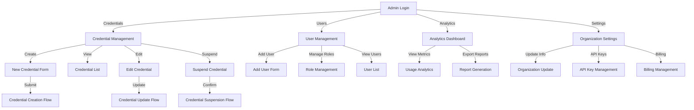

## 8. Error Handling Flow

### **System Error Management**

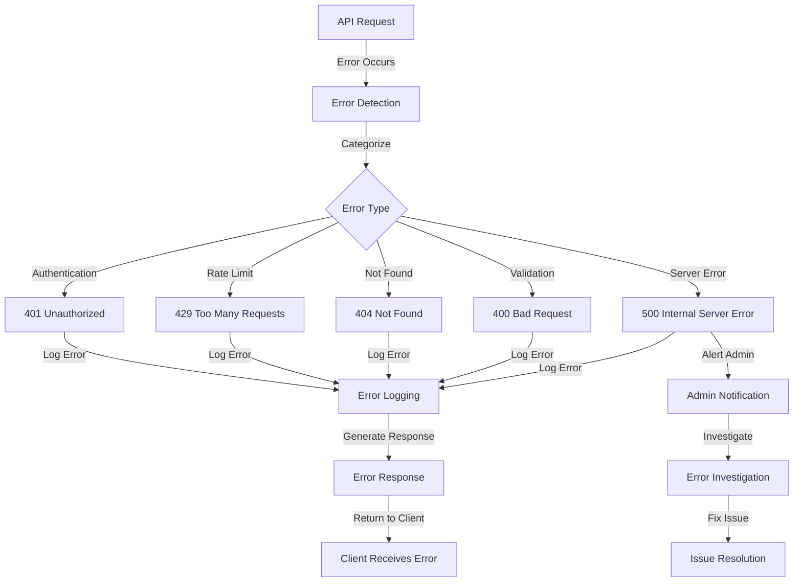

## 9. Security Flow

### **Security and Compliance**

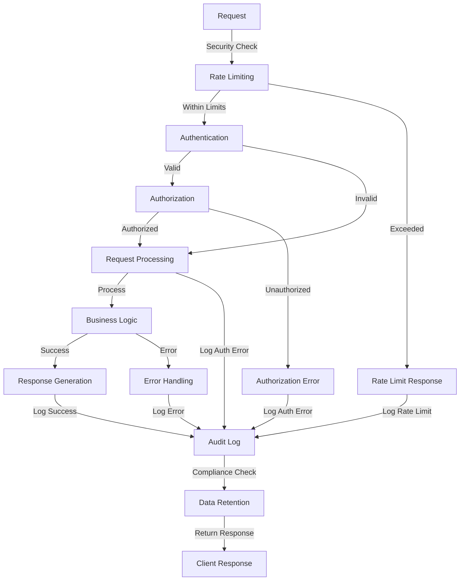

## 10. Data Flow Architecture

### **Complete System Data Flow**

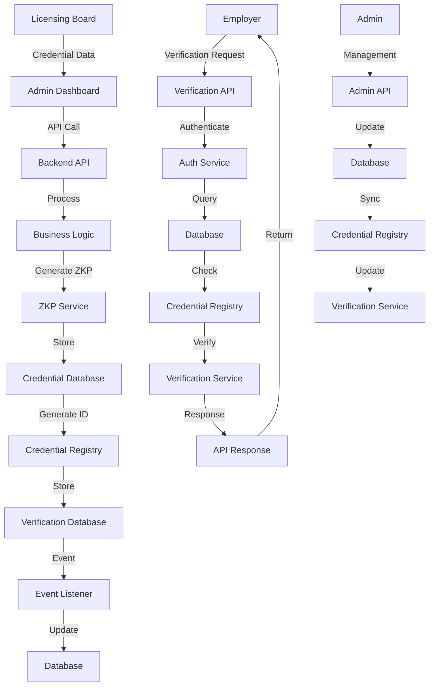

## 11. API Response Examples

### **Successful Verification Response**

```json
{
  "verified": true,
  "credential": {
    "credentialId": "MED-2024-001234",
    "examId": "medical-license-2024",
    "achievementLevel": "Passed",
    "issuedDate": "2024-01-15",
    "expiryDate": "2026-01-15",
    "issuer": "California Medical Board",
    "holderName": "Dr. John Smith",
    "licenseNumber": "MD123456"
  },
  "proofHash": "0xabcd...",
  "verificationTimestamp": "2024-01-15T10:30:00Z"
}
```

### **Error Response**

```json
{
  "verified": false,
  "error": {
    "code": "CREDENTIAL_NOT_FOUND",
    "message": "Credential with ID MED-2024-001234 not found",
    "timestamp": "2024-01-15T10:30:00Z"
  }
}
```

### **Batch Verification Response**

```json
{
  "results": [
    {
      "verified": true,
      "credentialId": "MED-2024-001234",
      "credential": {
        /* credential data */
      }
    },
    {
      "verified": false,
      "credentialId": "MED-2024-001235",
      "error": {
        /* error data */
      }
    }
  ],
  "summary": {
    "total": 2,
    "verified": 1,
    "failed": 1
  }
}
```

## 12. Performance Metrics

### **System Performance Flow**

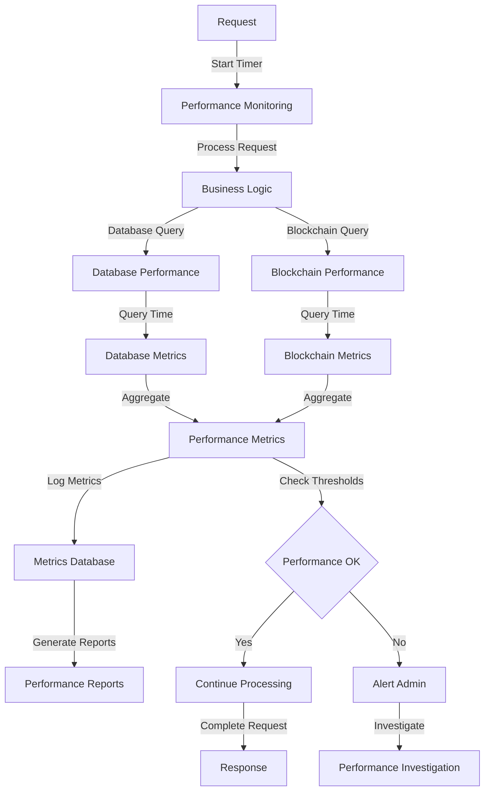

## Conclusion

These flow diagrams provide a comprehensive view of how the licensing verification platform works. They show the complete user journey from credential creation to verification, including error handling, security, and performance monitoring. The diagrams help developers understand the system architecture and implement the various components correctly.
